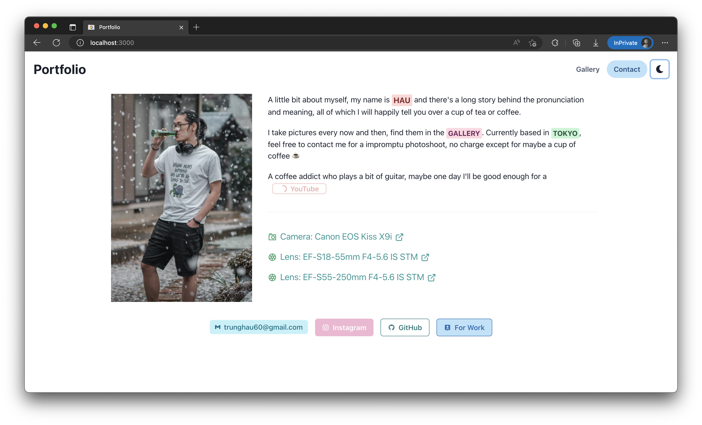
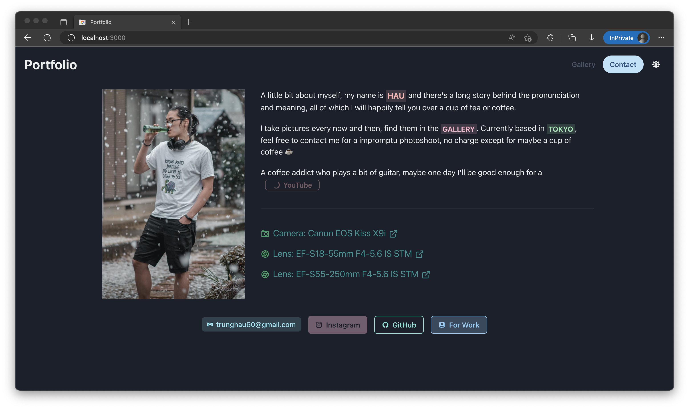

# Portfolio made with [React](https://reactjs.org/docs/create-a-new-react-app.html) and [Chakra UI](https://chakra-ui.com/)

## Info

[App dashboard](https://dashboard.heroku.com/apps/beomus-portfolio) and
[Website](https://beomus-portfolio.herokuapp.com/) **DEPRECATED**

Unfortunately, Heroku has suspended their free-tier, which I was using to host
this website.

## Screenshots

Here's what it looks like because nobody will clone and build and run this.

### Gallery

### Contact

